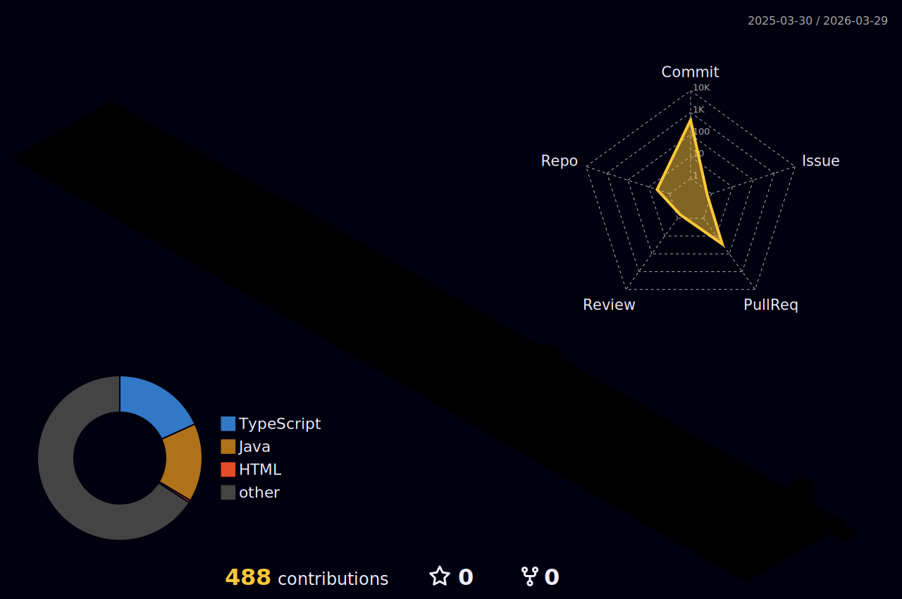

<!--
**izero33/izero33** is a ✨ _special_ ✨ repository because its `README.md` (this file) appears on your GitHub profile.

Here are some ideas to get you started:

- 🔭 I’m currently working on ...
- 🌱 I’m currently learning ...
- 👯 I’m looking to collaborate on ...
- 🤔 I’m looking for help with ...
- 💬 Ask me about ...
- 📫 How to reach me: ...
- 😄 Pronouns: ...
- ⚡ Fun fact: ...
-->

name: GitHub-Profile-3D-Contrib

on:
  schedule: # 00:00 KST == 15:00 UTC
    - cron: "0 15 * * *"
  workflow_dispatch:

jobs:
  build:
    runs-on: ubuntu-latest
    name: generate-github-profile-3d-contrib
    steps:
      - uses: actions/checkout@v3
      - uses: yoshi389111/github-profile-3d-contrib@0.7.1
        env:
          GITHUB_TOKEN: ${{ secrets.GITHUB_TOKEN }}
          USERNAME: ${{ github.repository_owner }}
      - name: Commit & Push
        run: |
          git config user.name github-actions
          git config user.email github-actions@github.com
          git add -A .
          git commit -m "update - 3D 그래프 업데이트"
          git push

      - name: Commit & Push
        run: |
          git config user.name izero33
          git config user.email izeroi313@gmail.com
          git add -A .
          git commit -m "generated"
          git push

 
